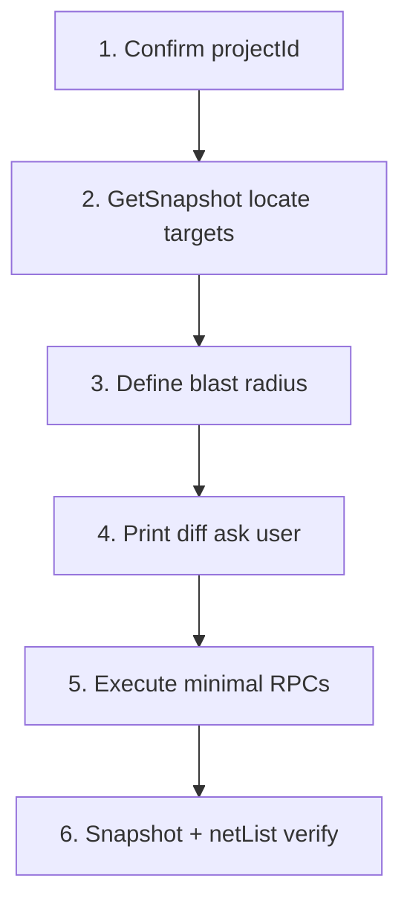

# Editing a circuit (local / surgical changes)

Use this when the task is **modify part of an existing design**, not redraw the
whole page: change a value, rewire one pin, replace one part, rename a net label.

**Flow C** — see [SYSTEM-PROMPT.md](../SYSTEM-PROMPT.md) §流程 C.

## When to use Flow C vs A vs B

| User intent | Flow |
| --- | --- |
| Draw a new circuit from scratch | **A** — patterns + placement |
| "What does VR201 do?" / read-only | **B** — [reading-a-circuit.md](./reading-a-circuit.md) |
| Change C201 to 1 µF / move R5 net / swap U3 | **C** — this doc |
| Fix **one module** on a partitioned schematic (reset block, power section, rewire in one box) | **C** — this doc + [modular-layout.md](./modular-layout.md) §单模块修补 |

**Never** clear the page or redraw the whole schematic for a local edit.

## Modular designs (single-block edit)

If the page already has **module frames / Chinese titles** (P4a):

1. **Do not** run a whole-page build script, `clearActivePageFull`, or Flow **A** P0–P4 — that is whole-page redraw.
2. **Flow B** first: `read-circuit.ts` with `REF=` on parts inside the broken module; note pin→net and `canvasObjectId`.
3. **Blast radius** = `moduleBlastRadius(client, ctx, refs)` (parts + neighbouring wires + union bbox) plus **that module’s** rect/text ids only. Print it, then delete with `deleteModuleBlastRadius` / `deleteModuleDecorations(moduleKey)`. Do **not** call `prepareP4aDecorations` (clears **all** decorations on the page).
4. Execute Flow C recipes; re-apply a **single** pattern only when the user asked to regenerate that subnet (host + roles in scope). To shift a block without redrawing it, use `moveExtBatch`.
5. If bbox changed: `deleteModuleDecorations(moduleKey)` → `unionModuleBBox` + `frameAroundContent` → `placeModuleFrameAndTitle` (with `note`) for **one** module.
6. Verify changed nets; skip full-page `layout-audit` / PDF unless the user wants a layout review.

Cross-ref: [modular-layout.md](./modular-layout.md) §单模块修补.

## Fixed workflow (mandatory order)



### 1. Confirm project

```typescript
const active = await client.project.getActiveProject({ context: editorCtx });
const projectId = active.project?.projectId;
console.log("projectId:", projectId); // print every run
const ctx = client.createProjectContext(projectId!);
```

### 2. Locate targets (snapshot + find)

| Need | Source |
| --- | --- |
| Topology / neighbors | `kernel.GetSnapshot` — see [reading-a-circuit.md](./reading-a-circuit.md) |
| Canvas object id for edit | `canvasObjectId` from snapshot **or** `FindObjectByProperty("Reference", ref)` → `objectIds[0]` |
| Property keys | [property-conventions.md](./property-conventions.md) — set designator with **`Part Reference`**, not `Reference` |

Run the read template for context before editing:

```bash
REF=VR201 npx tsx scripts/read-circuit.ts
REF=C201 TRACE=1 npx tsx scripts/read-circuit.ts   # optional series traversal
```

The script prints **canvas 编辑 id** block for the designator → edit bridge.

### 3. Blast radius (修改集)

Before any write, list **only** what will change:

| Edit type | Typical blast radius |
| --- | --- |
| Change Value / Footprint | That object only |
| Rename designator | That object + verify find by new ref |
| Rewire one pin | That pin stub/alias **or** **`connectPinsPlaceWire`**; avoid touching unrelated nets |
| Replace part | Old object + its wires (often delete old → place new → reconnect listed pins) |
| Bulk delete | **Forbidden** without explicit user confirmation |

Do **not** use `deleteObjectsByIds` on whole-page occupancy without user OK.

**Module frames / free text:** delete only ids from the **decoration ledger** (A) or future
`listPageDecorations` (E). **Do not** scan `GetSnapshot` or occupancy for rects/text — see
`decoration-objects.md`.

### 4. Print diff → user confirmation

**Mandatory** for Flow C (unless user explicitly said "just do it"):

```
计划修改:
  - C201 Value: 0.1 µF → 1 µF  (objectId=…)
  - VR201 pin5 仍接 N0261718，不改
爆炸半径: 1 个对象，0 条 net 重布
```

Wait for user confirmation before `SetObjectProperty` / delete / place.

Environment escape hatch: `CONFIRM=1` in script (document in script header).

### 5. Execute (minimal RPC set)

| Recipe | RPCs | Template script |
| --- | --- | --- |
| Edit property | `FindObjectByProperty` → `SetObjectProperty` | `scripts/edit-property-by-ref.ts` |
| Rewire pin | Snapshot pin + **`connectPinsPlaceWire`** **or** `placePinStubWireAndNetAlias` | `scripts/rewire-pin-by-ref.ts` |
| Replace part | Snapshot pose → `deleteObjectsByIds` → `placeKicadSymbol` → reconnect | `scripts/replace-part-by-ref.ts` |

Common rules:

- `SetObjectProperty`: `op: 1` (OBJ_PROP_SET), `commitUndo: true`
- Power symbol wiring: pin **`0`** on VCC/GND side
- After delete: poll occupancy until ids gone ([circuit-pattern-layout.md](./circuit-pattern-layout.md) § delete settle)
- After place: poll until new ids appear before wiring

**Rewire reality check:** there is no dedicated "disconnect this pin only" RPC in
the skill toolbox. Practical options:

1. **Join existing net:** `connectPinsPlaceWire` to a part already on the target net.
2. **Name a net at pin:** `placePinStubWireAndNetAlias` with target `netName` (routing gate in [placement-conventions.md](./placement-conventions.md)).
3. **True cut:** identify wire segments via `listWireSegments().wires` and delete only if user accepts risk — prefer (1)/(2) for surgical edits.

### 6. Dual-source verification

After writes:

1. **`GetSnapshot`** — target ref pin→net, no unexpected floating pins.
2. **`netList.getProjectNetList`** or `getActivePageNetList` — net membership for changed nets.
3. Re-run consistency checks from Flow B (e.g. `output_voltage` vs rail name).
4. Optional `zoomAll` when user wants visual check (Flow B default skips viewport changes).

## Safety rules (Flow C)

- **No** whole-page clear without confirmation.
- **No** Flow A pattern re-apply on existing design unless user asks to regenerate a subnet.
- **No** dependency on `GetConnectivity`, `selection.*`, `transaction.*` — see [rpc-availability.md](./rpc-availability.md).
- Prefer **one object / one net** per script; split large edits into reviewable steps.
- Report `projectId` and every `objectId` mutated in stdout.

## Recipe: edit property by REF

Env: `REF=C201` `PROP=Value` `NEW=1 µF` `CONFIRM=1`

See `template/scripts/edit-property-by-ref.ts`.

## Recipe: rewire pin by REF

Env: `REF=R201` `PIN=1` `TARGET_REF=U301` `TARGET_PIN=14` `CONFIRM=1`

Connects source pin to an existing part on the target net via **`connectPinsPlaceWire`** (PlaceWire).
For net-label-only targets, use `TARGET_NET=+3.3V` + stub/alias path in script comments.

See `template/scripts/rewire-pin-by-ref.ts`.

## Recipe: replace part by REF

Env: `OLD_REF=U3` `NEW_MPN=…` `CONFIRM=1`

1. Snapshot old position/rotation/mirrored + pin→net list.
2. User confirms diff (old deleted, new placed, N pins reconnected).
3. Delete old → place via part-search → reconnect pin-by-pin.

See `template/scripts/replace-part-by-ref.ts`.

## From understanding (B) to editing (C)

After Flow B / `read-circuit.ts`:

1. Copy `canvasObjectId` or `FindObject` id from output.
2. Use in Flow C script — **do not** guess ids from designator strings alone for wiring.
3. If `metadata.properties` was empty during read, still OK to edit Value/Footprint; do not invent MPN.

## Engine improvements (optional, not blocking)

Documented in [rpc-availability.md](./rpc-availability.md) § Skill-side workarounds:

- True `GetConnectivity` graph → replace client-side series BFS.
- Per-pin associated wire ids → safer disconnect.
- `FindNet` explicit unimplemented instead of silent false.
- Selection API for "edit this region".

Skill ships with snapshot BFS + find-by-property until engine catches up.
