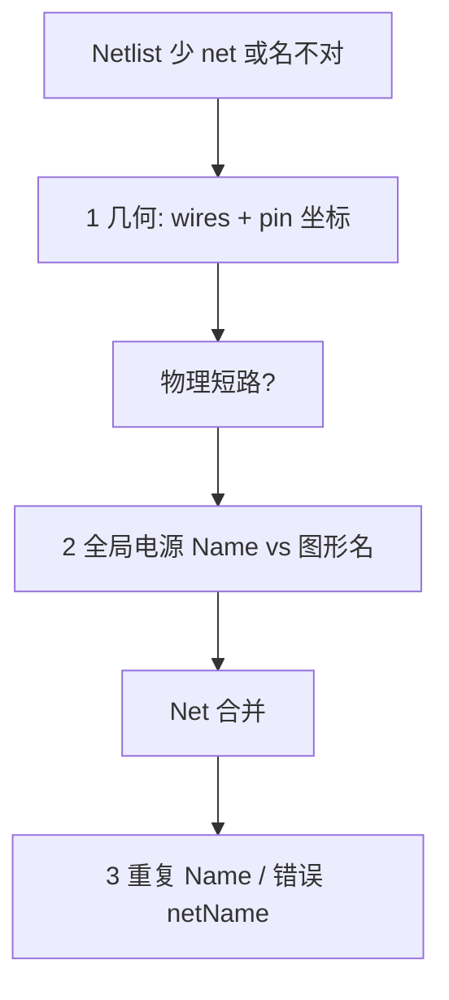

# 电源 / 网络异常排查（scenario-b）

当 netlist 里 **GND/VCC 名「消失」**、net 数量变少、或 Agent 在属性/命名上空转时，按本文处理。**先几何，后语义**。

## 常见症状

| 现象 | 常见真因（非 exhaustive） |
| --- | --- |
| `getActivePageNetList` 里找不到 `GND` | 与 `+3V3`/`VCC` **物理短接** 后 net **合并**，只剩一个名字 |
| 两枚全局电源符号之间只有一条短线 | **禁止类操作**：不同 rail 的 symbol↔symbol `autoConnect` |
| wire 的 `netName` 与 NetAlias 标签不一致 | wire 上是 **刷新后解析名**，勿单独当真理（见 [placement-conventions.md](placement-conventions.md) pin-stub 节） |
| pattern apply 后 rail 与 GND 似乎连在一起 | decap **链式拓扑** 或 layout 短接 → 见 [check-power-shorts](#check-power-shorts-apply-后) |

## 诊断顺序（固定）

1. **几何 / 物理短路** — `canvasOps.listWireSegments` → 字段 **`wires`**（不是 `wireSegments`）。看两全局电源符号 pin 0 是否被 **同一段或 L 型路径** 连通。
2. **全局电源身份** — `getObjectProperty(..., "Name")` 或 snapshot `symbolInstances` + `Name`；区分 **`symbolName`（图形）** 与 **`netName`（写入 Name 的网络名）**（见 AGENTS 硬性规则）。
3. **命名 / 合并** — 合并后 netlist 只保留一个名；用 snapshot `nets[]` + `pinReferences`，**禁止** `find.FindNet`（[rpc-availability.md](rpc-availability.md)）。

## 标准证伪实验

**假设：** 两电源 rail 被一段 wire 短接导致 GND「消失」。

1. 记录当前 `getActivePageNetList` 的 net 名列表与 pin 成员。
2. 定位连接两电源符号的那 **一段** wire（`listWireSegments` + 符号 `object_id` + pin 0 坐标，见 [property-conventions.md](property-conventions.md)）。
3. **删除该 wire**（或断开一端）→ `deleteObjectsByIds`。
4. **Falsifier：** 若删除后 **仍** 只有一个 net 或 GND 仍不出现 → 换假设类（不是简单 symbol↔symbol 短接），勿在同一假设上堆 patch。

写操作后调用 `waitForNetlistStable`（`template/scripts/modular-lib.ts`），**至少稳定一轮** 再下结论；禁止写后立刻单次 netlist 就断言。

## 禁止操作

| 禁止 | 正确做法 |
| --- | --- |
| `autoConnectObjectsById`：**+3V3/VCC symbol ↔ GND symbol**（不同 rail） | 各 symbol 只连 **器件脚 / 电容脚**；同 rail 靠 **多个符号 + 相同 Name** 扩展，不是 symbol 互连 |
| 未看 wire 几何以 net 名是否存在判断「网络消失」 | 先 `wires` + pin 坐标，再 netlist |
| `find.FindNet` 判断 net 是否存在 | `snapshot.nets` 或 `getActivePageNetList` |
| `selection.*` 做排查 | 未实现（rpc-availability 禁建列表） |

## 数据源优先级

1. **`listWireSegments().wires`** — 段几何 + 解析后 `netName`（external 坐标与 Place* 一致时，Y 向下；与 snapshot 换算见 property-conventions `PAGE_TOP`）。
2. **`kernel.GetSnapshot`** — 引脚坐标在 **顶层 `pinInstances[]`**（`position` + `canvasObjectId`），**不在** `symbolInstances` 条目内；用 `canvasObjectId === object_id` + `symbolDefinitions.pins` 解析 pin 号。若误以为「symbol 里没有 pin 字段 = 快照无引脚几何」→ 读 [reading-a-circuit.md](reading-a-circuit.md) § Pin geometry is not inside symbolInstances。若 `pinInstances` 为空或滞后 → `getObjectJsonById` 的 `PortInstScalar` 或 definition 几何 + instance 位姿（[property-conventions.md](property-conventions.md) § Pin Coordinates）。
3. **`netList.getActivePageNetList`** — `result.value.nets[]`，引脚在 `pinReferences[]`。

**勿** 用 wire 端点坐标 **反推** pin 归属（与 `placePinStubWireAndNetAlias` 邻脚误判同族问题）。

## 与 pattern 的关系

- Pattern 内 `connections[].routed=true` 的 net：**不要** 重连（[circuit-pattern-layout.md](circuit-pattern-layout.md)）。
- 本文管 **pattern 外**、**手误短接**、**apply 后 rail/GND 几何冲突**。

## check-power-shorts（apply 后）

每次 `ApplyCircuitPattern`（尤其 `decoupling_cap`）后建议：

1. 读 `response.connections`、`occupiedBox`。
2. 若 **竖向 cap 列 ≥3** 或 `occupiedBox` **高而窄**（链式拓扑），用 `listWireSegments` 检查 **+rail 与 GND** 是否在几何上 **一条可达路径**（不应跨 rail 短路）。
3. 若发现错误短接：**允许** 删除错误 wire / 局部改线 / 重 apply —— 这与「禁止重复 pattern 已路由 net」不矛盾（见 circuit-pattern-layout § Decoupling cap）。
4. （可选）引擎 stdout 有 `[PL:route]` 时：核对 `connections` 中 wire 增量与 `wireObjectIds` 数量；无日志则仅用 snapshot + wires。

## Case：3V3 与 GND 两 symbol 直连

1. Agent 用 `autoConnect` 连接两枚 **不同 Name** 的全局电源 → 物理短路。
2. 网表合并 → 只看到一个 net 名 → 误以为 GND「被删」。
3. **修复：** 删中间 wire；分别把 3V3/GND symbol 连到 **负载/去耦脚**；写后 `waitForNetlistStable` 再验收。

## 调试纪律（Agent）

- 每个实验写一句 **falsifier**（什么结果说明假设错误）。
- **同一假设类** 连续 **3 次** 实验失败 → **必须换假设类**（例如从「命名错误」换到「物理短路」），禁止第 4 次同思路 patch。
